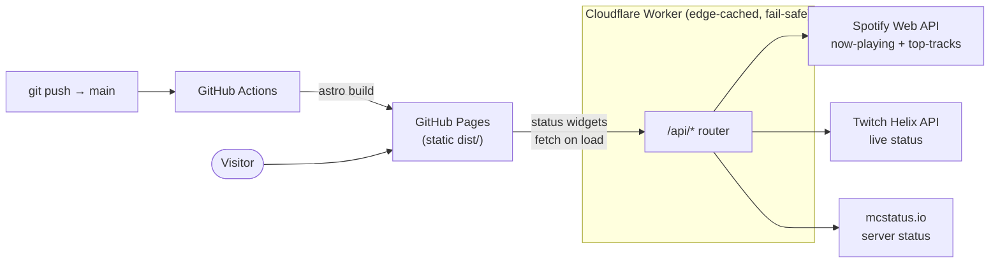

# merricstrough.com

The personal site of **Merric Strough** (handle: `MeteoricMetric`) — builder, gamer, creator.

🌐 **Live:** [merricstrough.com](https://merricstrough.com)

An HTML-first personal site built with **Astro 6 + TypeScript**, shipped as fully static
files to **GitHub Pages**. It's near-zero client JavaScript by default — the only runtime
JS is a handful of small progressive-enhancement islands (theme toggle, hero canvas, and
the "live" status widgets). Those widgets get their data from a companion **Cloudflare
Worker** that proxies Spotify, Twitch, and Minecraft so the static site can show live
state without a backend of its own.

## Features

- **Static landing page** composed from a design-token system — hero, identity blurb,
  top tracks, project cards, and a follow grid.
- **Live status widgets** (client-side fetch, all with static fallbacks):
  - **Now Spinning** — what Merric is currently playing on Spotify
  - **Top Tracks** — his 4-week Spotify top tracks
  - **Twitch Live** — a live/offline indicator for [`@meteoricmetric`](https://www.twitch.tv/meteoricmetric)
  - **Minecraft Status** — player count + up/down for the game server
- **Content routes:** `/` (home), `/now` (an [IndieWeb /now page](https://nownownow.com)),
  `/art`, `/twitch`, `/youtube`, `/minecraft`, plus a custom `404`.
- **Git-backed CMS** — hero media, copy, and project entries are editable through
  [Pages CMS](https://pagescms.org/) (schema in `.pages.yml`), validated by Zod on build.
- **Cross-site family graph** — links to related family sites via `<link rel="me">` and
  JSON-LD `Person` schema (see ADR-0003).
- **Performance + a11y as gates**, not aspirations — Lighthouse CI enforces ≥ 95 on
  Performance / Accessibility / Best Practices / SEO, and Playwright + axe-core run
  smoke, visual, a11y, and perf checks.
- **Baked-in ops hygiene** — inlined CSS, AVIF/WebP responsive images, View Transitions,
  viewport prefetch, `security.txt`, CodeQL, and Dependabot.

## How it works

The site is 100% static at rest. Anything "live" is fetched in the browser from the
Cloudflare Worker at request time; the Worker is the only piece that holds secrets and
talks to third-party APIs. Every Worker endpoint is edge-cached and returns safe-fallback
JSON on error (never a 5xx), so a flaky upstream degrades a widget instead of breaking the
page.



The Worker exposes four `GET` routes — `/api/now-playing`, `/api/top-tracks`,
`/api/twitch-status`, `/api/minecraft-status` — each with its own cache policy tuned to the
upstream's rate limits. The frontend reaches them through a single source-of-truth module,
`src/data/worker-config.ts`. Worker setup and secret handling live in
[`worker/README.md`](worker/README.md).

## Tech stack

- **[Astro 6](https://astro.build/)** — HTML-first, static output, CSS inlined, images
  optimized to AVIF/WebP via the Sharp service
- **TypeScript** (strict) — including typed content collections and structural data
- **Vanilla CSS** with an OKLCH design-token layer (`src/styles/`)
- **[Geist Sans + Geist Mono](https://vercel.com/font)** self-hosted variable fonts
- **[Pages CMS](https://pagescms.org/)** — git-backed admin (`.pages.yml`)
- **[Cloudflare Workers](https://developers.cloudflare.com/workers/)** — the live-data
  proxy (`worker/`), pure-fetch, zero runtime deps
- **[Biome](https://biomejs.dev/)** — lint + format
- **[Playwright](https://playwright.dev/) + [axe-core](https://github.com/dequelabs/axe-core)**
  — smoke, visual, a11y, and perf tests
- **[Lighthouse CI](https://github.com/GoogleChrome/lighthouse-ci)** — ≥ 95 on all four categories
- **GitHub Actions** — CI (lint/check/build), deploy to Pages, CodeQL, Lighthouse; plus Dependabot

Architectural decisions live in [`docs/decisions/`](docs/decisions/) as ADRs.

## Quickstart

Requires Node **22.18** (pinned in `.nvmrc`; CI reads the same file).

```bash
npm install         # install dependencies
npm run dev         # dev server at http://localhost:4321
npm run build       # production build to ./dist (prebuild optimizes images)
npm run preview     # preview the production build locally
npm run check       # astro check — types + content-collection diagnostics
npm run lint        # Biome lint + format check
npm run lint:fix    # Biome, auto-fix
npm run format      # Biome format (write)
npm test            # Playwright test suite
npm run test:ui     # Playwright UI mode
```

Asset generation (run when source assets change): `npm run favicons`, `npm run og`,
`npm run images`, or `npm run assets` for all three.

The Cloudflare Worker is a separate deploy target — see [`worker/README.md`](worker/README.md)
for one-time Spotify/Twitch setup, secrets, and `wrangler` commands.

## Project structure

```
.
├── docs/decisions/      # Architectural Decision Records (ADRs)
├── public/              # Static assets copied verbatim (fonts, icons, CNAME, .well-known/)
├── scripts/             # Build-time asset generators (favicons, OG image, image optim)
├── src/
│   ├── components/       # Astro components (Hero, Projects, live-status widgets, …)
│   ├── content/          # CMS-managed content (hero, identity, now, projects/*.md)
│   ├── content.config.ts # Typed `projects` collection (Zod schema)
│   ├── data/             # Typed structural data (family graph, accounts, worker config)
│   ├── layouts/          # BaseLayout
│   ├── pages/            # File-based routes (index, now, art, twitch, youtube, minecraft, 404)
│   ├── scripts/          # Client islands (hero canvas effects, UI micro-interactions)
│   └── styles/           # Design tokens, reset, base, motion CSS
├── tests/               # Playwright + axe (smoke, visual, a11y, perf)
├── worker/              # Cloudflare Worker — live-data proxy (Spotify, Twitch, Minecraft)
├── .github/workflows/   # ci · deploy · codeql · lighthouse
├── astro.config.mjs
├── biome.json
├── playwright.config.ts
└── .pages.yml           # Pages CMS schema
```

## Repo conventions

See [`CLAUDE.md`](CLAUDE.md) for operating principles, design-system rules, security
standards, accessibility expectations, and AI-collaboration protocol. Operational details
(registrar, hardware, secret variable names) live in `CLAUDE.local.md` — gitignored, local
clone only.

## Family graph

This site cross-links with [shanestrough.com](https://shanestrough.com) and (in the future)
sibling sites. The model lives in [`src/data/family.ts`](src/data/family.ts) and
[`src/data/accounts.ts`](src/data/accounts.ts), surfaced via `<link rel="me">` and JSON-LD
`Person` schema. See [ADR-0003](docs/decisions/0003-cross-site-family-graph-implementation.md).

## Status

Active, v2 in progress (`package.json` version `2.0.0-pre.1`). The site is live at
[merricstrough.com](https://merricstrough.com); the home page, `/now`, and the live-status
widgets are wired end-to-end, and CI/deploy/Lighthouse/CodeQL are all in place. Several
secondary routes (`/art`, `/twitch`, `/youtube`, `/minecraft`) are lightweight
stub-and-redirect pages that will grow.

## License

Personal site code — UNLICENSED. Content (writing, art, custom assets) © Merric Strough,
all rights reserved.
